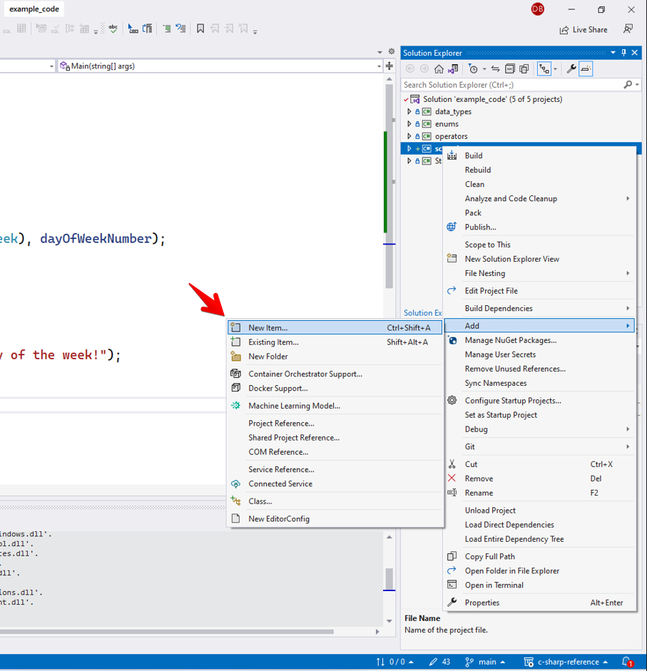
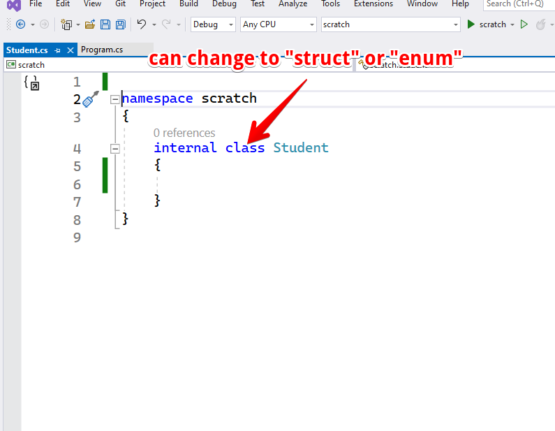
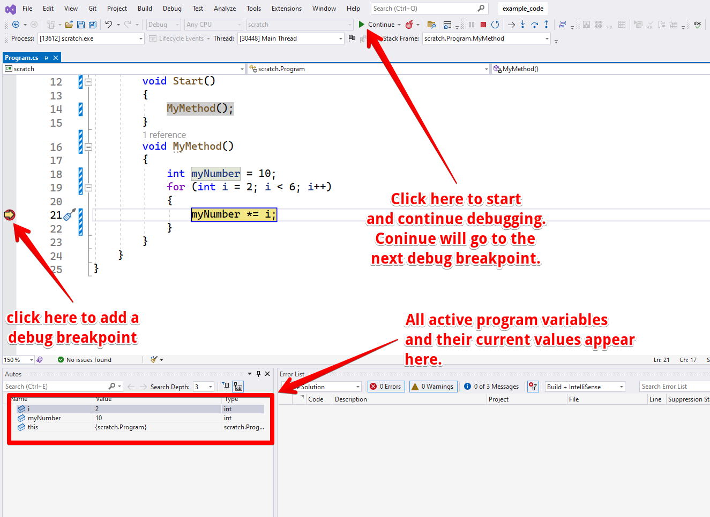
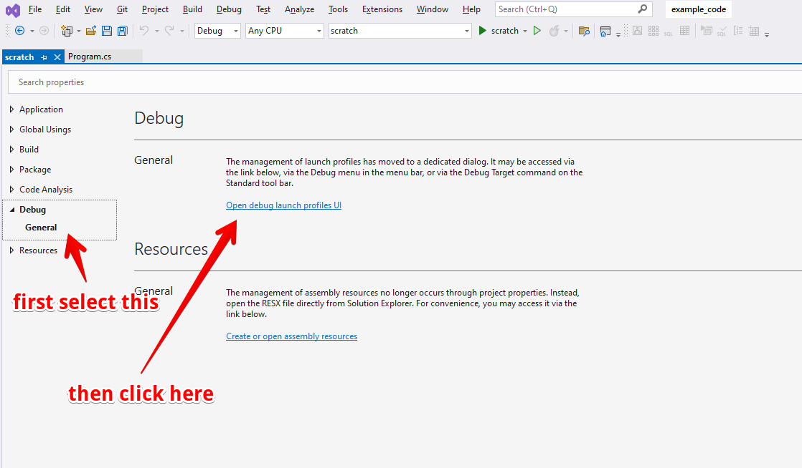
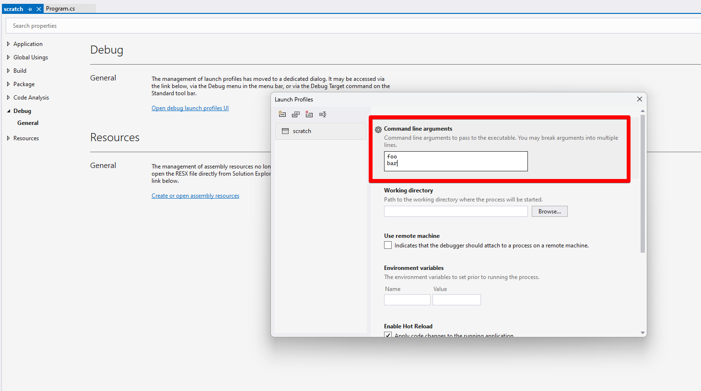

## About

This document serves as a quick reference for beginning C# programmers.

## Contents

- [About](#about)
- [Contents](#contents)
- [Conventions](#conventions)
- [Variables and basic data types](#variables-and-basic-data-types)
  - [Basic data types:](#basic-data-types)
  - [Declaring and defining variables](#declaring-and-defining-variables)
    - [Example, declaring and defining variables using basic data types](#example-declaring-and-defining-variables-using-basic-data-types)
- [Comments](#comments)
- [String interpolation](#string-interpolation)
  - [String concatenation with addition operator](#string-concatenation-with-addition-operator)
  - [String interpolation with brackets](#string-interpolation-with-brackets)
- [Operators](#operators)
  - [Math operators](#math-operators)
    - [Math operator examples](#math-operator-examples)
  - [Relational operators](#relational-operators)
    - [Relational operators examples](#relational-operators-examples)
  - [Unary and binary operators](#unary-and-binary-operators)
    - [Example unary and binary operators](#example-unary-and-binary-operators)
- [Console input and output](#console-input-and-output)
  - [Output](#output)
    - [Output example](#output-example)
  - [Input](#input)
    - [Parsing numeric values from console input](#parsing-numeric-values-from-console-input)
- [Conditional statements](#conditional-statements)
  - [If statements](#if-statements)
  - [If/else statements](#ifelse-statements)
  - [If/else-if statements](#ifelse-if-statements)
  - [Switch statements](#switch-statements)
    - [Switch statement example](#switch-statement-example)
- [Iteration](#iteration)
  - [While loop](#while-loop)
  - [Do-while loops](#do-while-loops)
  - [For loops](#for-loops)
- [Arrays](#arrays)
  - [Array indexing](#array-indexing)
  - [Multidimensional arrays](#multidimensional-arrays)
  - [Array lengths](#array-lengths)
  - [Array iteration](#array-iteration)
    - [Array iteration - for loop](#array-iteration---for-loop)
    - [Array iteration - foreach loop](#array-iteration---foreach-loop)
  - [Copying arrays](#copying-arrays)
- [Methods](#methods)
  - [Method signatures](#method-signatures)
  - [Method overloading](#method-overloading)
  - [Method scope and passing data](#method-scope-and-passing-data)
  - [Pass by value](#pass-by-value)
  - [Pass by ref](#pass-by-ref)
  - [Pass by ref out](#pass-by-ref-out)
- [Enums](#enums)
  - [Enums an ints](#enums-an-ints)
  - [Casting enums](#casting-enums)
  - [Iterating enums](#iterating-enums)
- [Struct](#struct)
  - [public properties](#public-properties)
- [Classes](#classes)
  - [Classes vs objects](#classes-vs-objects)
    - [Static class methods](#static-class-methods)
  - [Structs vs classes variable types](#structs-vs-classes-variable-types)
- [Adding a new file for enums, structs and classes](#adding-a-new-file-for-enums-structs-and-classes)
- [Flow Control](#flow-control)
  - [Break](#break)
  - [Continue](#continue)
  - [Return](#return)
- [Debugging in Visual Studio](#debugging-in-visual-studio)
  - [Debug demo](#debug-demo)
- [Command line arguments](#command-line-arguments)
  - [Command line arguments demo](#command-line-arguments-demo)
- [Lists](#lists)
  - [Iterating lists](#iterating-lists)
- [Dictionary](#dictionary)
- [File IO](#file-io)
  - [File paths](#file-paths)
  - [Reading file data](#reading-file-data)
  - [Writing data to file](#writing-data-to-file)
  - [Checking for existence of a file](#checking-for-existence-of-a-file)
- [Try/catch](#trycatch)
  - [Throwing errors](#throwing-errors)

## Conventions

In the code examples, `// ~>` is used to illustrate what would be output by the console:

```csharp
Console.WriteLine("hello!"); // ~> hello
```

## Variables and basic data types

Variables hold data in C#. Variables must have a type. The variable's type is the type of data the variable can hold.

### Basic data types:

- `int` - an integer. An integer is a positive or negative whole number. An int in C# can hold values between -2,147,483,648 and 2,147,483,647.
- `long` - a long integer. A long integer is the same as an integer but can hold a larger range of numbers. A long can contain integers between -9,223,372,036,854,775,808 and 9,223,372,036,854,775,807.
- `double` - a double precision floating point number. Doubles hold decimal numbers up to 15 decimal digits.
- `float` - a floating point number. Floats hold decimal numbers up to 6 decimal digits.
- `char`- a char. A char holds a single character.
- `string` - a string. A string holds a series of characters (like a word or a sentence).
- `bool` - a boolean. A boolean holds a true or false value.

### Declaring and defining variables

When a variable is declared in C#, it is given a name. When a variable is defined it is given a value.

#### Example, declaring and defining variables using basic data types

```csharp
int myInt;
long myLong;
double myDouble;
float myFloat;
char myChar;
string myString;
bool myBool;

myInt = 1;
myLong = 9223372036854775807;
myDouble = 1.333333333337;
myFloat = 1.34f;
myChar = 'a';
myString = "hello";
myBool = true;
```

Variables can also be declared and defined on the same line. For example:

```csharp
int myInt = 1;
```

## Comments

Comments are text in the program that is ignored by the compiler. Comments are typically used for documenting your code. There are two main ways to write comments:

```csharp
// This is a single line comment
/*
  This is a multiline comment.
  Multiline comments can take up multiple lines.
*/
```

## String interpolation

Interpolation means adding data to a string. C# has a few methods for interpolating strings.

### String concatenation with addition operator

```csharp
int i = 3;
Console.Writeline("The value of i is: " + i); // ~> The value of i is 3
```

### String interpolation with brackets

Data can be added to strings using brackets in two main ways:

Using a `$` character with brackets:

```csharp
int i = 3;
Console.WriteLine($"The value of i is {i}"); // ~> The value of i is 3
```

Using numbered arguments and brackets:

```csharp
int i = 3;
int j = 4;
Console.WriteLine("The values of i and j are {0} and {1}", i, j); // ~> The values of i and j are 3 and 4
```

## Operators

Operators perform actions on variables and return a value.

### Math operators

- `+` - addition
- `-` - subtraction
- `*` - multiplication
- `/` - division. When integer values divided, the remainder is omitted from the result.
- `%` - modulo. The modulo operator gives you the remainder value.

#### Math operator examples

```csharp
int myIntA = 5;
int myIntB = 2;

double myDoubleA = 5.0;
double myDoubleB = 2.0;

Console.WriteLine(myIntA + myIntB); // ~> 7
Console.WriteLine(myIntA - myIntB); // ~> 3
Console.WriteLine(myIntA / myIntB); // ~> 4 (NOTE, no remainder!)
Console.WriteLine(myIntA % myIntB); // ~> 1

Console.WriteLine();

Console.WriteLine(myDoubleA + myDoubleB); // ~> 7
Console.WriteLine(myDoubleA - myDoubleB); // ~> 3
Console.WriteLine(myDoubleA / myDoubleB); // ~> 2.5
Console.WriteLine(myDoubleA % myDoubleB); // ~> 1
```

### Relational operators

Relational operators compare two values and return a bool (true/false) value.

- `>` greater than
- `<` less than
- `>=` greater than or equal to
- `<=` less than or equal to
- `==` equal to
- `!=` not equal to

#### Relational operators examples

```csharp
int myIntA = 5;
int myIntB = 2;
int myIntC = 2;

Console.WriteLine(myIntA > myIntB); // ~> true
Console.WriteLine(myIntA < myIntB); // ~> false
Console.WriteLine(myIntB >= myIntC); // ~> true
Console.WriteLine(myIntB <= myIntC); // ~> true
Console.WriteLine(myIntB == myIntC); // ~> true
Console.WriteLine(myIntB != myIntC); // ~> false
```

### Unary and binary operators

Unary and binary are shorthand operators that perform an operation and assign a value in a single statement.

Unary and binary operators:

- `++` increments (increases) value by one
- `--` decrements (decreases) value by one
- `+=` adds a value and assigns it
- `-=` subtracts a value and assigns it
- `*=` multiples a value and assigns it
- `/=` divides a value and assigns it
- `%=` performs module operation and assigns it

#### Example unary and binary operators

```csharp
int x = 10;
x++; // x is 11
x--; // x is 10
x += 10; // x is 20
x -= 5; // x is 15
x *= 2; // x is 30
x /= 5; // x is 6
x %= 2; // x is 0
```

## Console input and output

For console applications, you can output text that the user can read and receive input text that the user writes.

### Output

The main methods to write output to the console are `Console.Write` and `Console.WriteLine`. The difference between the methods is that `Console.WriteLine` method will add a new line in the console.

#### Output example

```csharp
Console.Write("hello!"); // this will not create a new line
Console.WriteLine("hell again"); // this will add a new line of text to the console
```

### Input

To read text that the user enters use `Console.ReadLine`. Input is always returned as a `string`.

```csharp
string input = Console.ReadLine();
```

#### Parsing numeric values from console input

To change the type of the input string to a double, use `int.Parse()`:

```csharp
int number = int.Parse(Console.ReadLine());
```

To change the type of the input string to a double, use `double.Parse()`:

```csharp
double number = double.Parse(Console.ReadLine());
```

## Conditional statements

Conditional statements allow you to execute code only if certain conditions are true.

### If statements

An if statement gets executed only if a condition is true.

```csharp
int x = 3;
int y = 4;
if(x < 4){
    Console.WriteLine("x is less than y");
}
```

### If/else statements

If/else statements include a block of code that gets executed if they if condition is false.

```csharp
int x = 3;
int y = 4;
if(x < 4){
    Console.WriteLine("x is less than y");
} else {
    Console.WriteLine("y is less than x");
}
```

### If/else-if statements

If/else-if statements have an unlimited number of conditions that can be checked.

```csharp
int x = 3;
if(x == 1){
    Console.WriteLine("x is 1");
} else if (x == 2){
    Console.WriteLine("x is 2");
} else if (x == 3){
    Console.WriteLine("x is 3");
} else {
    // final else statement is optional
    Console.WriteLine("x is neither 1, 2, or 3");
}
```

### Switch statements

Switch statements check that a variable matches a condition. `break` should always be used inside a matching statement inside a switch condition. An optional `default` case can be used in case none of the conditions match.

#### Switch statement example

```csharp
int place = 2;
switch(place){
    case 1:
        Console.WriteLine("you receive a gold");
        break;
    case 2:
        Console.WriteLine("you receive a silver");
        break;
    case 3:
        Console.WriteLine("you receive a bronze");
        break;
    default:
        Console.WriteLine("you do not receive a meal");
}
```

## Iteration

Iteration involves looping over a block of code, typically multiple times.

### While loop

While loops get repeated _while_ a condition it true.

Example:

```csharp
int i = 0;
while(i < 3){
    Console.WriteLine($"The value of i is: {i}");
    i++;
}
```

### Do-while loops

Do-while loops work the same as while loops except, the condition gets checked after the loop runs once. Do-while loops are useful when you want your code to run at least once.

```csharp
string input;
do
{
    input = Console.ReadLine();
    Console.WriteLine($"You entered: input");
} while (input != "stop");
```

### For loops

For loops are typically used when you need a block of code to run a certain number of times. This loop will print the numbers from 1 to 10:

```csharp
for (int i = 1; i <= 10; i++)
{
    Console.WriteLine(i);
}
```

The for loop consists of three parts:

1. An initializing statement (`int i = 1;`). This initializes a variable used by the other parts of the for loop.
2. A condition (`i <= 10`). The loop will run while this condition is `true`.
3. An update (`i++`). This will run each loop and update the value of the main loop variable (`i` in this case).

## Arrays

An array is a collection of data. Unlike a variable that can hold only one item, an array can contain multiple items.

All items in an array must contain the same type of data.

A basic int array declaration example:

```csharp
int[] myNumbers;
```

To use an array, a size must be specified. This can either be done when the array is first declared:

```csharp
int[] myNumbers = new int[10];
```

or after:

```csharp
int[] myNumbers;
myNumbers = new int[10];
```

You usually must use the `new` keyword when setting the size of an array. The above array can hold 10 integers.

You do not need to use the `new` keyword if you immediately set the values of the array. You set the values using curly braces and commas between the values:

```csharp
int[] myNumbers = { 1, 2, 3, 4, 5, 6, 7, 8, 9, 10 };
```

### Array indexing

You read and write values in an array based on the item's index. The item index goes inside the square brackets. Array indexes start at 0 instead of 1.

```csharp
int[] myNumbers;
myNumbers = new int[10];
myNumbers[0] = 111; // set the first item in the array
myNumbers[1] = 222; // set the second item in the array
// ...

// read the first number in the array
int firstNumber = myNumbers[0];
Console.WriteLine($"The first item in the array is {firstNumber}"); // ~> The first item in the array is 111
```

### Multidimensional arrays

So far, we have looked at single dimensional arrays. These are like a single row in spreadsheet. Arrays can have more dimensions. For instance, a two-dimensional instead of a single row of values, can be thought of as a spreadsheet with multiple rows and columns.

To declare a multidimensional array add a comma for each additional dimension the array has:

```csharp
int[,] myNumbers = new int[2,3]; // create a new two-dimensional array with 2 x 3 dimensions
```

When getting and settings values in a two-dimensional array, values for both dimensions need to be specified:

```csharp
int[,] myNumbers = new int[2,3]; // create a new 2 x 3 array
myNumbers[0,0] = 1;
myNumbers[0,1] = 2;
myNumbers[0,2] = 3;
myNumbers[1,0] = 4;
myNumbers[1,1] = 5;
// ...
```

The number of dimensions an array has can be accessed using the `.Rank` property:

```csharp
int[,] myNumbers = new int[2,3];
Console.WriteLinke(myNumbers.Rank); // ~> 2
```

### Array lengths

The `Array.Length` property will return the total number of elements in the array.

The `Array.GetLength()` method will return the total number of elements along the dimension of the array. You use `Array.GetLength(0)` to get the first dimension of the array, `Array.GetLength(1)` to get the second dimension, etc.

```csharp
int[] myNumbers = new int[10];
int[,] myOtherNumbers = new int[2, 3];

// .Length property
Console.WriteLine(myNumbers.Length); // ~> 10
Console.WriteLine(myOtherNumbers.Length); // ~> 6

// .GetLength() method
Console.WriteLine(myNumbers.GetLength(0)); // ~> 10
Console.WriteLine(myOtherNumbers.GetLength(0)); // ~> 2
Console.WriteLine(myOtherNumbers.GetLength(1)); // ~> 3
```

### Array iteration

Array iteration means looping through each element in an array. Typically a `for` or a `foreach` loop is used for this task.

#### Array iteration - for loop

A for loop starts at 0 and uses the array `.Length` property to loop through each element of the array:

```csharp
int[] myNumbers = new int[10];
for (int i = 0; i < myNumbers.Length; i++) {
    myNumbers[i] = i;
}
for (int i = 0; i < myNumbers.Length; i++)
{
    Console.WriteLine(myNumbers[i]); // ~> 0, 1, 2, 3...
}
```

#### Array iteration - foreach loop

A foreach loop automatically assigns the element of the array to a variable as you loop through the array:

```csharp
int[] myNumbers = { 2, 4, 6, 8, 10 };
foreach(int number in myNumbers)
{
    Console.WriteLine(number); // ~> 2, 4, 6...
}
```

### Copying arrays

Arrays are copied by reference. That means, when you assign one array to another array, they are both referencing the same data. If you change data in the first array, it will also change data in the copied array:

```csharp
int[] myNumbers = { 11, 22, 33, 44 };
int[] myOtherNumbers = myNumbers;

myNumbers[0] = 777;
Console.WriteLine(myOtherNumbers[0]); // ~> 777
```

## Methods

Methods contain code that can perform logic, actions and procedure in code. Methods can be called multiple times, can take data in and return data.

```csharp
namespace testing
{
    internal class Program
    {
        static void Main(string[] args)
        {
            int myNumber = AddOne(1);
            Console.WriteLine(myNumber); // ~> 1
        }
        static int AddOne(int number) {
            return number + 1;
        }
    }
}
```

### Method signatures

```csharp
static int AddOne(int number) {
    return number + 1;
}
```

A method signature defines the method and its input and output data. In the above, example `static int AddOne(int number)` is the method signature. This is the meaning of each part of the signature:

- `static` - this means the method belongs to the class itself, instead of an instance of the class (more on that later).
- `int` is the return type. Methods can return data but they don't have to. For this method, an integer is returned. If nothing is returned from the method, `void` should be used.
- `AddOne` is the name of the method. You will use this when you are calling (using) the method.
- `int number` is a parameter. Parameters describe the data that gets passed into the method. The code in the method can access this data.

### Method overloading

Two methods can have the same name but accept a different number of arguments, this is referred to method overloading. The compiler automatically determines the correct method to call when the program is getting built.

In this example, the `SaySomething()` method is overloaded:

```csharp
namespace testing
{
    internal class Program
    {
        static void Main(string[] args)
        {
            SaySomething("hip", "hip"); // ~> hip hip
            SaySomething("hooray!"); // ~> hooray!
        }
        static void SaySomething(string word, string secondWord)
        {
            Console.WriteLine($"{word} {secondWord}");
        }
        static void SaySomething(string word) {
            Console.WriteLine(word);
        }
    }
}
```

### Method scope and passing data

Data can get passed to methods in three main ways: pass by value, pass by ref, pass by ref out. Depending on how the data is passed, it will affect where and how variables are updated.

### Pass by value

By default, for simple data types (`int`, `double`, `string`, etc.) a copy of the data gets passed to the method. The changes that the method makes to the data only affect the copied variable. This is called passing data by value.

```csharp
namespace testing
{
    internal class Program
    {
        static void Main(string[] args)
        {
            int number = 5;
            SquareNumber(5);
            Console.WriteLine(number); // ~> 5
        }
        static void SquareNumber(int number)
        {
            number = number * number;
        }
    }
}
```

In this example, the value of `number` inside the `Main()` method does not change since `SquareNumber()` only receives a copy of the `number` variable.

### Pass by ref

Unlike pass by value, when data is passed to a method using pass by ref, the actual variable gets passed to the method _not_ a copy of the data. When data is passed by ref, changes made inside the method will affect the original data. When a method uses pass by ref, the `ref` keyword must be used in the method signature _and_ on the argument that gets passed into the method.

```csharp
namespace testing
{
    internal class Program
    {
        static void Main(string[] args)
        {
            int number = 5;
            SquareNumber(ref number); // `ref` is added here
            Console.WriteLine(number); // ~> 25
        }
        static void SquareNumber(ref int number) // `ref` is also added here
        {
            number = number * number;
        }
    }
}
```

### Pass by ref out

Pass by ref out works similar to pass by ref except, the variable does not need to have a value set _and_ the method _must_ set a value for the pass by ref out parameter inside the method.

```csharp
namespace testing
{
    internal class Program
    {
        static void Main(string[] args)
        {
            int number; // number has no initial value. This is allowed for `out` but not for `ref`.
            SetToThree(out number); // `out` must be added before the argument
            Console.WriteLine(number); // ~> 3
        }
        static void SetToThree(out int number) // `out` must also be added to the method parameters
        {
            number = 3; // out parameters _must_ be set inside the method
        }
    }
}
```

## Enums

An enum (enumeration) is a set of constant values referenced by names.

```csharp
namespace enums
{
    internal class Program
    {
        enum DayOfWeek
        {
            Monday,
            Tuesday,
            Wednesday,
            Thursday,
            Friday,
            Saturday,
            Sunday
        }
        static void Main(string[] args)
        {
            DayOfWeek today = DayOfWeek.Monday;
            if (today == DayOfWeek.Monday)
            {
                Console.WriteLine("yawn, it's Monday");
            }
            else if (today == DayOfWeek.Saturday || today == DayOfWeek.Sunday)
            {
                Console.WriteLine("hooray! it is the weekend!");
            }
        }
    }
}
```

In the example above, an enum `DayOfWeek` is used instead of using string values or integer codes. Enums are strongly typed and help avoid typos and ensure our data is of the expected type.

### Enums an ints

Enums values are backed by simple `int` values. By default, the first item in an enum will have the value `0`, the second `1`, etc. We can change the default value using the `=` sign. After assigning a value, each following enum will be one greater than the previous.

```csharp
enum DayOfWeek
{
    Monday = 1, // Monday is now 1 (instead of 0), Tuesday 2, etc.
    Tuesday,
    Wednesday,
    Thursday,
    Friday,
    Saturday,
    Sunday
}
```

### Casting enums

Casting means to change the data type of a data item. To cast an enum, you will typically either call the `.toString()` method to get the string value or use `(int)` to get an integer value.

```csharp
DayOfWeek today = DayOfWeek.Monday;
Console.WriteLine(today.ToString()); // ~> Monday
Console.WriteLine((int) today); // ~> 1
```

To convert an `int` to an enum, you follow a similar pattern:

```csharp
int dayOfWeekNumber = 1;
DayOfWeek day = (DayOfWeek) dayOfWeekNumber;
```

If you have an `int` value that you want to cast to an enum, you can check to make sure that it is a defined value using the `Enum.IsDefined()` method.

```csharp

int dayOfWeekNumber = 99; // invalid day of week value
bool isValidWeekNumber = Enum.IsDefined(typeof(DayOfWeek), dayOfWeekNumber);

if (isValidWeekNumber)
{
    DayOfWeek day = (DayOfWeek) dayOfWeekNumber;
    Console.WriteLine($"The day for number {dayOfWeekNumber} is {day}");
}
else
{
    Console.WriteLine($"{dayOfWeekNumber} is not a day of the week!");
}
```

### Iterating enums

To iterate (loop through) enums, you can use a for loop.

```csharp
for (DayOfWeek day = DayOfWeek.Monday; day <= DayOfWeek.Sunday; day++)
{
    Console.WriteLine(day.ToString()); // ~> Monday, Tuesday...
}
```

## Struct

A struct is a structured collection of data. Structs allow you to group together related data inside a single data structure.

```csharp
namespace scratch
{

    struct Student
    {
        public string Id;
        public string Name;
        public int Age;
        public int GraduationYear;
    }

    internal class Program
    {
        static void Main(string[] args)
        {
            Student student = new Student();
            student.Id = "000134a";
            student.Name = "Gallant";
            student.Age = 25;
            student.GraduationYear = 2085;

            Console.WriteLine($"Student {student.Name} will graduate in {student.GraduationYear}");
        }
    }
}
```

_note: typically, you should define your struct in a separate file._

### public properties

Structs must use the keyword `public` on their properties to allow reading and writing those properties.

## Classes

Classes are similar to structs but they also alow methods to be grouped with the class data.

```csharp
namespace ClassDemo
{
    class Student
    {
        public string Id;
        public string Name;
        public int Age;
        public int GraduationYear;

        public void IntroduceYourself() {
            Console.WriteLine($"Hello, I'm {Name} and I am {Age} years old.");
        }
    }

    internal class Program
    {
        static void Main(string[] args)
        {
            Student student = new Student();
            student.Id = "000134a";
            student.Name = "Gallant";
            student.Age = 25;
            student.GraduationYear = 2085;

            student.IntroduceYourself();
        }
    }
}
```

_note: normally, you should define your class in a separate file._

Like properties, class methods must use the keyword `public` to be usable outside the class. If methods are only used inside the class, `private` should be used.

### Classes vs objects

A class is like a blueprint for an object. A class defines the data and methods an object will have. An object is an instance of a class. In the example above, `Student student = new Student();` creates a new student object from the class `Student`.

```csharp
Student student1 = new Student();
Student student2 = new Student();
Student student3 = new Student();
```

In this example `Student` is the class, `student1`, `student2`, `student3` are objects.

#### Static class methods

Static class methods belong to the class, not the object. You do _not_ need to create an object to use a static method. For most things, you do _not_ want to use static methods. Static methods do not have access to object data (properties).

```csharp
namespace ClassDemo
{

    class Student
    {
        // ...
        static public void StaticMethodDoSomething() // static method belongs to the class, no objects
        {
            Console.WriteLine("I can only be called without creating a student object.");
        }

        public void InstanceMethodDoSomething() // Does not contain the `static` keyword. Instance methods can only be called on instances.
        {
            Console.WriteLine("I can only be called without creating a student object.");
        }
    }

    internal class Program
    {
        static void Main(string[] args)
        {
            Student.DoSomething(); // a `new()` student does not need to be created to call a static method.

            Student myStudent = new Student();
            myStudent.InstanceMethodDoSomething();
        }
    }
}
```

### Structs vs classes variable types

Structs are copy and pass by value. That means when you assign one struct to another, a _copy_ of the data is made. Objects are passed by ref. That means, when you assign or pass an object into a method, you are passing a reference to the underlying class. Any changes made to the object inside the method will affect the object outside the method. For structs, this is not the case. Their data is copied and then passed into the method.

## Adding a new file for enums, structs and classes

Typically, when you add enums, structs and classes, you'll want to add them in separate files. This will help keep your project organized. To do this, in solution explorer, right-click on your project, select "add", select "new item":



Choose an appropriate name for your new item.

After creating, by default, a new class will be added. You can change "class" to "struct" or "enum" if needed:



## Flow Control

Flow control describes the flow and order that operations are performed within a program.

### Break

To exit out of a loop early, you can use the `break;` statement.

```csharp
for (int i = 0; i < 5; i++)
{
    if (i == 3)
    {
        break;
    }
    Console.WriteLine(i); // ~> 0, 1, 2
}
```

The above snippet will print 0, 1, and 2 but will `break` and exist the loop before 3 is printed.

### Continue

The `continue` statement causes the loop to continue with the next iteration (the next loop) but skips all the code in the loop after the `continue statement`.

```csharp
for (int i = 0; i < 7; i++)
{
    if (i % 2 == 0)
    {
        continue;
    }
    Console.WriteLine(i); // ~> 1, 3, 5
}
```

The above loop will print only the odd numbers. Whenever an even number occurs (`i % 2 == 0`), the `continue` is executed causing the rest of the code to be skipped.

### Return

The `return` statement returns from a method. No code after `return` will get executed.

```csharp
void MyMethod()
{
    Console.WriteLine("method starting");
    for (int i = 0; i < 5; i++)
    {
        if (i == 2)
        {
            return;
        }
        Console.WriteLine(i);
    }
    Console.WriteLine("method ending");
}
```

This method will log the following to the console:

```
method starting
0
1
```

"method ending" never gets printed. Once the `return` statement gets executed, the method returns control to the calling method.

## Debugging in Visual Studio

Debugging allows us to view the values of our variables while our program is running. A _breakpoint_ is a point in our code where we want the debugger to pause and allow us to inspect our variables.

To add a breakpoint in Visual Studio, click in the left margin. Once a breakpoint is added, you can remove it by clicking on it again.

To run the debugger, click the play button in the toolbar or press _f5_. To continue to the next breakpoint, click continue in the toolbar or press _f5_ again. To stop the debugger, pres _shift + f5_ or click the stop button in the toolbar.

When the debugger pauses your code, you will see the variable data in the output section.



### Debug demo

<video width="978" height="854" controls>
  <source src="./video/debug.mp4" type="video/mp4">
  Your browser does not support the video tag.
</video>

## Command line arguments

Command line arguments are arguments that get passed into our program. If our program is started from the terminal, we can add command arguments there. If we start the program via Visual Studio, we will need to add them different.

To add command line arguments in Visual Studio:

- right click on your project
- select properties
- click debug -> general -> open debug launch profiles ui
- add command line arguments under "command line arguments" section
- you can add multiple arguments by separating each argument by either a space or a new line




### Command line arguments demo

<video width="926" height="479" controls>
  <source src="./video/command-line-arguments.mp4" type="video/mp4">
  Your browser does not support the video tag.
</video>

## Lists

C# lists are used to store multiple elements of the same type. Lists are a lot like arrays but are not fixed in size so elements can be added and removed dynamically.

Lists are a _generic_ type. That means, you must specify the type of data your list will hold.

```csharp
List<int> myIntList = new List<int>();
List<float> myFloatList = new List<float>();
List<string> myStringList = new List<string>();
```

The example above creates a new integer list. The `<int>` part means the list can hold only integers.

You use the `.Add()` method to add elements to the list.

```csharp
list.Add(23);
list.Add(45);
```

Once the elements are added. You can read and write the elements just like arrays:

```csharp
Console.WriteLine(list[0]);
list[0] = 77;
```

### Iterating lists

Lists can be iterated through using either a `for` loop or a `foreach` loop.

Lists use the `.Count` attributed to determine their length

```csharp
List<int> list = new List<int>();
list.Add(23);
list.Add(35);
list.Add(17);
for (int i = 0; i < list.Count; i++) // Note! use .Count instead of .Length for lists
{
    Console.WriteLine(list[i]); // print list element
    list[i]++; // increment list element
}
foreach (int item in list)
{
    Console.WriteLine(item); // write list item
}
```

## Dictionary

A C# dictionary is used to associate a key with a value. Dictionary's are generics so, we must specify the type of the key and the value.

Creating a new dictionary:

```csharp
Dictionary<int, string> students = new Dictionary<int, string>();
```

The `<int, string>` part of the declaration means that the key for the dictionary is an `int` and the value is a `string`.

To add items to a dictionary, you use the `.Add(key, value)` method:

```csharp
Dictionary<int, string> students = new Dictionary<int, string>();
students.Add(123, "Orsen");
```

To access items in the dictionary, you use square brackets and the item's key:

```csharp
Dictionary<int, string> students = new Dictionary<int, string>();
students.Add(123, "Orsen");
Console.WriteLine(students[123]); // ~> Orsen
```

If you try to add two items with the same key, you will get an error. To check if a key already exists in the dictionary, use the `ContainsKey()` method:

```csharp
// create a new dictionary with int key and string value
Dictionary<int, string> students = new Dictionary<int, string>();
if (students.ContainsKey(123))
{
    Console.WriteLine("student 123 already exists!");
}
else
{
    students.Add(123, "Orsen");
}

Console.WriteLine(students[123]); // ~> Orsen
```

## File IO

File IO stands for file input/output. With file IO, we either _read_ data from the file (_input_) or _write_ data to a file (_output_).

When performing file operations in C#, we need to use the `System.IO` library. We do this by declaring the following at the top of our file:

```csharp
using System.IO;
```

Whenever we read or write file data, we perform these basic steps:

1. open file
2. read or write data
3. close file

It is important to close the file to prevent wasting system resources.

### File paths

When you access files in your C# program, you will need to specify the path relative to your _built_ application, _not_ the location of your program file.

In practice, this means you will likely need to move up three directory file levels to access a file at the same directory level as your `Program.cs` file:

```csharp
string filename = "..\\..\\..\\some-file.txt";
```

### Reading file data

Use the `StreamReader` class to read file data.

```csharp
string filename = "..\\..\\..\\some-file.txt";
StreamReader reader = new StreamReader(filename);
string line;
while ((line = reader.ReadLine()) != null)
{
    Console.WriteLine(line);
}
reader.Close();
```

### Writing data to file

To write data to a file, you can use the `StreamWriter` class.

```csharp
string filename = "..\\..\\..\\some-file.txt";
StreamWriter writer = new StreamWriter(filename);
writer.WriteLine("foo");
writer.WriteLine("bar");
writer.WriteLine("baz");
writer.Close();
```

### Checking for existence of a file

You can use the `File.Exists()` method to determine if a file already exists.

```csharp
string filename = "..\\..\\..\\some-file.txt";
if(File.Exists(filename)){
    // now we can safely open the file
    StreamReader reader = new StreamReader(filename);
    // ...
}
```

## Try/catch

To prevent exceptions from causing your application to crash, you can use a try/catch block.

```csharp
try
{
    Console.WriteLine("Input a string value that can not be parsed to an int to trigger an error: ");
    int number = int.Parse(Console.ReadLine());
}
catch (Exception e)
{
    Console.WriteLine(e.Message); // ~> Input string was not in a correct format.
}
```

If you have code that needs to run whether or not an exception occurs, you can use a `finally` block

```csharp
try{
    // ...
}
catch (Exception e){
// ...
}
finally{
    Console.WriteLine("This block will get executed whether or not an error occurs.");
}
```

### Throwing errors

If instead of catching an exception, you want to create one, you can throw a new exception.

When you throw an exception, you pass a `string` argument to the exception constructor which becomes the exception message:

```csharp
try
{
    Console.Write("Input an int value greater than 100 to throw an error.");
    int number = int.Parse(Console.ReadLine());
    if (number > 100) {
        // the string value here, becomes the exception message
        throw new Exception("Number can not be greater than 100!");
    }
}
catch (Exception e)
{
    Console.WriteLine(e.Message); // ~> Number can not be greater than 100!
}
```
